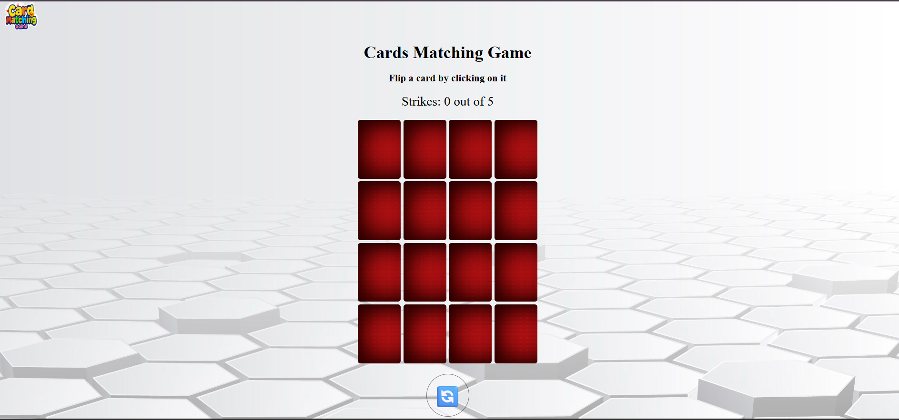

# Cards Matching Game

## Game's Name: Cards Matching Game ##

### Description: 
The Card Matching Game is a memory challenge to test your focus and your ability to memorize. The objective is to find and match pairs of cards by flipping two cards each time. If the two cards have identical images, they remain visible; otherwise, they flip back. You can make up to 5 mistakes (strikes). If you match all the cards before reaching 5 strikes, you win! If you reach 5 strikes before matching all cards, you lose.

### Background:
I chose this game as a practice for JavaScript specially, HTML, and CSS to learn or test my ability to web development skills.

## Getting Started
Give it a try [Cards Matching Game](link required).

## Attributions
- Emoji icons sourced from [getemoji](https://getemoji.com/).
- Logo generated by [POE](https://poe.com/) tool.

## Technologies Used
- JavaScript
- HTML
- CSS

## Next Step
- Sound effects for flipping, matching cards, and winning.
- Include a score and timer.
- Display numbers on the cards.
